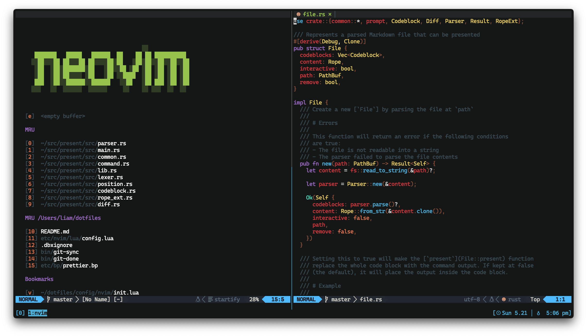

## dotfiles

My preferences for macOS. I use [dotbot](https://github.com/anishathalye/dotbot) to manage everything.

### ls /etc | less

- [`bin`](https://github.com/terror/dotfiles/tree/master/bin): scripts
- [`brewfile`](https://github.com/terror/dotfiles/blob/master/brew/brewfile): programs
- [`etc`](https://github.com/terror/dotfiles/tree/master/etc): various configuration files
- [`functions`](https://github.com/terror/dotfiles/blob/master/etc/bash/functions): miscellaneous bash snippets
- [`macos`](https://github.com/terror/dotfiles/blob/master/etc/macos): macos-specific settings
- [`nvim`](https://github.com/terror/dotfiles/tree/master/etc/nvim): neovim configuration
